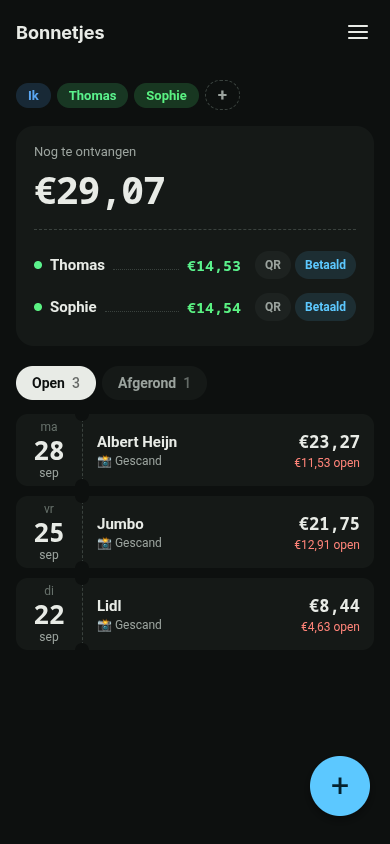
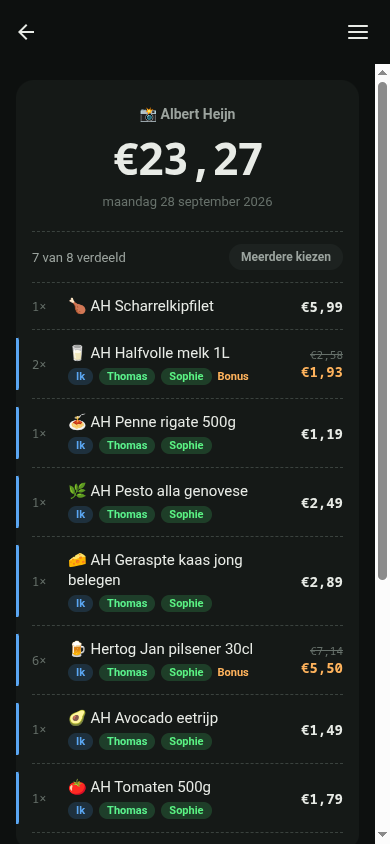
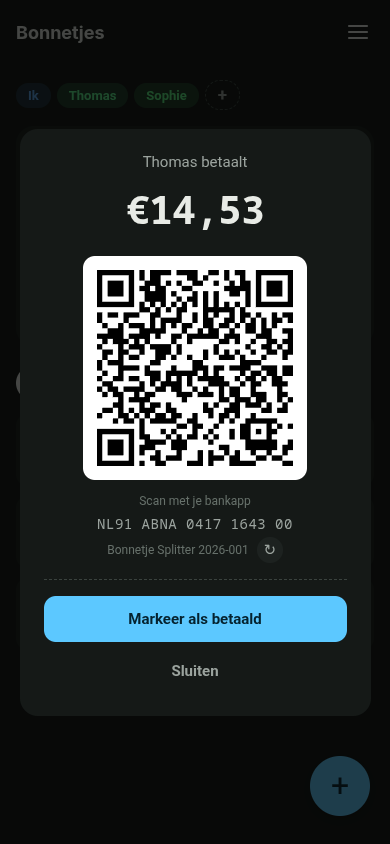

# Bonnetje Splitter

Split supermarket receipts (a photo of any store's receipt; optionally Albert Heijn, for self-hosters) between
housemates, keep track of who has paid, and hand out invoices. The app is in Dutch and uses Dutch IBANs / SEPA
payment QR codes for now.

You run your own server (Docker, one command) and connect the app to it with the server address and a password.
One server can also serve several people (users), each with their own key and their own private data
([server/README.md](server/README.md#users-more-than-one-person)), managed from a local admin dashboard
([server/README.md](server/README.md#admin-dashboard)).
Not affiliated with or endorsed by Albert Heijn or Google.

<p align="center">
  
  
  
</p>

```
bonnetje/
├─ server/      Python server: data, receipt scanning (Gemini), optional Albert Heijn. No dependencies.
├─ bonnetje/    Expo / React Native app (iOS and Android, also runs in the browser)
└─ .github/     workflows (iOS + Android build and publish, server Docker image) and the download page
```

## Server

Runs as a Docker container, or on your PC with plain `python3`.
See [server/README.md](server/README.md) for the settings and API, and [server/DEPLOY.md](server/DEPLOY.md) for
Docker, updating and backups.

```bash
cd server && ./run.sh          # or: RECEIPT_APP_KEY=secret python3 server.py
```

The Albert Heijn integration is **off by default** (`RECEIPT_USE_AH_API=false`). It uses an unofficial API and is
meant only for your own self-hosted server: see [server/README.md](server/README.md#albert-heijn-optional).

Set `RECEIPT_IBAN` and `RECEIPT_NAME` in the server settings to get the payment QR code in the app, and optionally `RECEIPT_BUNQ` (a bunq.me handle) for a shareable payment link (everything
personal lives on the server; the app contains no account details; extra users get theirs from the dashboard or `tenant payee`). All settings are listed in
[server/README.md](server/README.md#settings), and `server/.env.example` is a template to copy.

## App

```bash
cd bonnetje
npm install
npx expo start
```

On first start the app asks for the server address and the key (`RECEIPT_APP_KEY`, the server's password).
Plain `http://` is only used for addresses inside your own network (private IPs, Tailscale, `localhost`,
`*.local`); any other address must be HTTPS.

## How the numbers work

Every amount is a whole number of cents, and each one is worked out once, in `bonnetje/src/utils/settle.ts`.
Discounts that belong to no product are spread over what is assigned, in proportion to the price, to the cent.
A shared item can be split between any number of people, and each person can take more than one part
(5 beers: 3 for you, 1 each for two others). It is split exactly (the odd cent rotates between people). The receipt page, the balance, the QR code
and the invoices all read those same amounts, so they always add up. Old receipts are settled again the first
time the list loads.

The split is stored on the server as whole cents (`cents` on each assignment). Older releases stored euros in
`amount`; the app converts that when it loads, and saves the new format with the next change.

## Tests

```bash
cd bonnetje && npm test                         # unit tests for the money logic (vitest)
cd server && python3 -m unittest discover -s tests # server tests
```

## Publishing the apps

The unsigned iOS IPA and an Android APK are built by GitHub Actions and published on GitHub Pages. The IPA
can be downloaded on the phone and signed with your own certificate (Feather, AltStore, SideStore, ...);
the APK can be installed directly on Android.

One-time setup: [**Settings > Pages**](https://github.com/tcvdh/bonnetje/settings/pages), then
**Build and deployment > Source: GitHub Actions.**
A private repo works for this with GitHub Pro (Pages needs a paid plan for private repos), but the
published site is public.

Then, from the default branch, open [**Actions > Build and publish**](https://github.com/tcvdh/bonnetje/actions/workflows/build.yml)
and press **Run workflow.** When it finishes:

| What | Link |
|---|---|
| Download page | <https://tcvdh.github.io/bonnetje/> |
| IPA | <https://tcvdh.github.io/bonnetje/BonnetjeSplitter.ipa> |
| APK | <https://tcvdh.github.io/bonnetje/BonnetjeSplitter.apk> |
| Source (add in Feather / AltStore / SideStore) | <https://tcvdh.github.io/bonnetje/altstore.json> |
| Older builds | [Releases](https://github.com/tcvdh/bonnetje/releases) |

The site only holds the latest build of each platform (a platform you skip in a run is carried over from the live site). Every build is also kept as a GitHub release (tag
`v<version>-build.<n>`). Type a version in the workflow form (`X.Y.Z`, anything else stops the run; or bump `expo.version` in `bonnetje/app.json`) for a new version
number; the build number goes up by itself.

The APK is signed with Expo's public debug key for now (testing phase). That is fine for sideloading, but anyone
can sign an APK that installs over it, and moving to a real key later means every Android user uninstalls once.

The site also gets `version.txt` (<https://tcvdh.github.io/bonnetje/version.txt>), the version in plain text. The app
checks it on start, when it comes back to the front, and on pull to refresh, and compares it with its own version:

| New version | In the app |
|---|---|
| patch (`1.1.2` to `1.1.3`) | Yellow banner on the list ("Versie 1.1.3 is uit"); tap it to download. The app keeps working. |
| minor or major (`1.1.x` to `1.2.0`, `2.0.0`) | Red "Update nodig" over the whole app; nothing works until the new version is installed. |

So bump the minor version when old installs must stop writing the shared data (a breaking change to its shape or
meaning), and the patch version for everything else. Offline, or with no `version.txt`, the app shows nothing.

Every run writes `version.txt`, also when a platform was skipped or failed. So build **both** platforms in a run that
bumps the minor or major version: otherwise installs of the other platform are locked with no newer build to install.

## Privacy and security

- [PRIVACY.md](PRIVACY.md): what the app and the server store and where receipt photos go.
- [SECURITY.md](SECURITY.md): how to report a vulnerability, and how to run the server safely.

## License

Copyright (C) 2026 tcvdh. [GNU Affero General Public License v3.0](LICENSE) (AGPL-3.0). If you run a modified version of the server as a
service for other people, you must offer them its source code.
